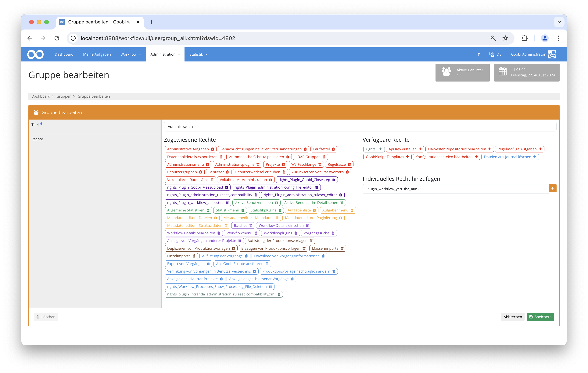
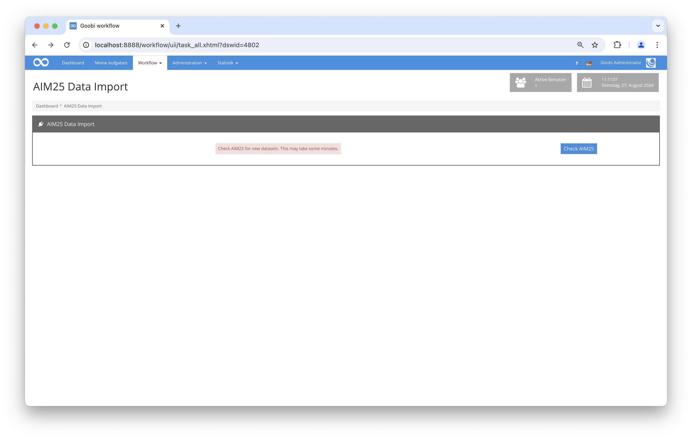

## Einführung
Dies ist eine technische Dokumentation für das YerushaAim25 Goobi-Workflow-Plugin. Es überprüft AIM25 auf neue EAD-Datensätze, lädt diese herunter und erstellt Goobi-Workflow-Prozesse dafür.

## Installation
Um das Plugin verwenden zu können, müssen die folgenden Dateien installiert werden:


```bash
/opt/digiverso/goobi/plugins/workflow/plugin-workflow-yerusha-aim25-base.jar
/opt/digiverso/goobi/plugins/GUI/plugin-workflow-yerusha-aim25-gui.jar
/opt/digiverso/goobi/config/plugin_intranda_workflow_yerusha_aim25.xml
```

Um dieses Plugin zu verwenden, muss der Benutzer die entsprechende Rollenberechtigung haben.

Weisen Sie daher der Gruppe die Rolle `Plugin_workflow_yerusha_aim25` zu.



## Überblick und Funktionalität
Wenn das Plugin korrekt installiert und konfiguriert wurde, ist es unter dem Menüpunkt `Workflow` zu finden.



Auf der Seite des Plugins wird nach Klick auf die Schaltfläche die Liste der Datensätze in AIM25 abgefragt. Für alle Datensätze, für die noch keine Goobi-Prozesse erstellt wurden, werden die Datensätze heruntergeladen und basierend auf der im Konfigurationsfile angegebenen Vorlage in Goobi-Prozesse umgewandelt. Dabei wird die EAD-Datei mit den angegebenen XPath-Ausdrücken durchsucht und entsprechende Metadaten für den Goobi Prozess erstellt.

## Konfiguration
Das Plugin wird in der Datei `plugin_intranda_workflow_yerusha_aim25` wie folgt konfiguriert:

{{CONFIG_CONTENT}}

Die folgende Tabelle enthält eine Zusammenfassung der Parameter und deren Beschreibungen:

Parameter               | Erläuterung
------------------------|------------------------------------
|  `templateTitle` | Dieser Parameter gibt den Titel der Workflow-Vorlage an, die bei der Erstellung neuer Prozesse verwendet wird.  |
|  `documenttype` | Dieser Parameter definiert den Goobi-Dokumenttyp für importierte Dokumente.  |
|`importFolder`| Ein Ordner, in dem Daten temporär gespeichert werden können. |
|`importNumber`   | Für Tests: Wenn dieser Wert nicht leer oder 0 ist, wird bei jedem Durchlauf des Plugins nur diese Anzahl von Datensätzen importiert.   |
|`mapping`  | XPath-Zuordnungen von den EAD-Dateien zu Goobi-Metadaten. |
